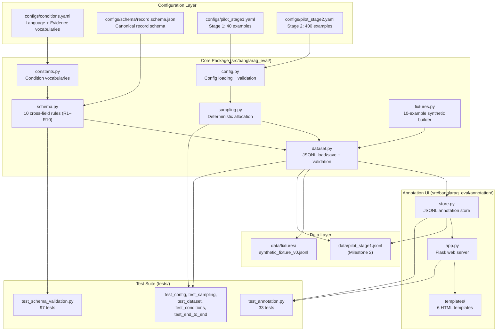
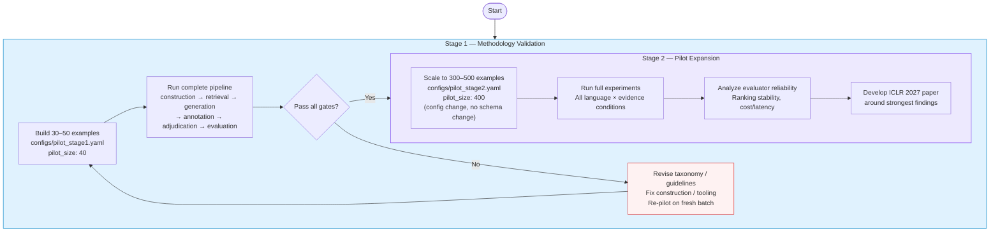
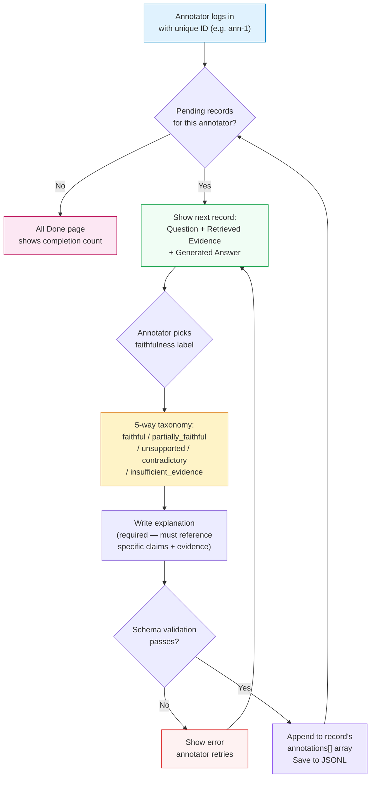
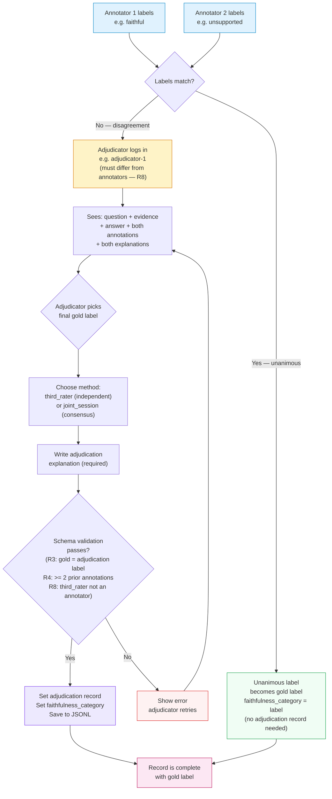
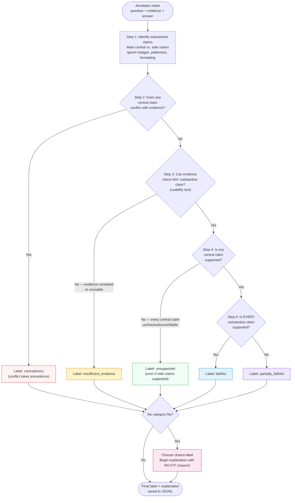

# Benchmarking RAG Faithfulness Evaluation in Low-Resource and Code-Mixed Languages: A Bangla Study

> Research repository — ICLR 2027 target

## Research Objective

We investigate whether existing RAG faithfulness evaluators that perform reasonably well in English remain reliable when transferred to:

- Native Bangla RAG
- Translated Bangla data
- Bangla-English code-mixed RAG
- Controlled retrieval conditions

The project focuses on evaluator reliability, not only model performance. Human annotations will serve as the independent reference standard.

## Research Questions

**RQ1.** How well do existing RAG faithfulness evaluators agree with human judgments on native Bangla RAG?

**RQ2.** How does evaluator reliability change under Bangla-English code-mixing, translated versus native data, and controlled retrieval corruption?

**RQ3.** Which evaluation approach provides the best trade-off between human agreement, robustness, ranking stability, cost, and latency?

---

## Architecture Overview

The repository is organized around a strict separation of concerns:
**retrieval**, **generation**, **annotation**, and **evaluation** are
logically isolated stages that enrich the same record without overwriting
each other's data.



---

## Pipeline Flow

Every benchmark record is **created once and enriched by later stages**
without ever being redesigned. Scaling from 10 → 50 → 500 examples changes
only data volume, never structure.

```mermaid
flowchart LR
    subgraph Stage1["1. Data Construction"]
        SOURCE["Source Documents<br/>(local, Bangla Wikipedia, curated)"]
        QUESTION["Question Generation<br/>+ source span + intended answer"]
        EVIDENCE["Evidence Condition<br/>Construction / Corruption"]
    end

    subgraph Stage2["2. Retrieval"]
        RETRIEVE["Retriever<br/>(BM25 / Dense / Hybrid)"]
        RERANK["Reranker<br/>(optional)"]
        CONTEXT["retrieved_context<br/>+ retrieval_documents[]"]
    end

    subgraph Stage3["3. Generation"]
        GENERATOR["Generator<br/>(GPT-4o / Claude / Local)"]
        ANSWER["generated_answer<br/>+ answer_claims[]"]
    end

    subgraph Stage4["4. Human Annotation"]
        ANN1["Annotator 1<br/>(label + explanation)"]
        ANN2["Annotator 2<br/>(label + explanation)"]
        ADJ["Adjudication<br/>(if disagreement)"]
        GOLD["gold label<br/>faithfulness_category"]
    end

    subgraph Stage5["5. Automatic Evaluation"]
        EVAL["Evaluators<br/>(RAGAS, LLM judge, ARES,<br/>encoder detector, baseline)"]
        METRICS["Metrics<br/>(P/R/F1, κ, AUROC,<br/>ranking stability, cost)"]
    end

    SOURCE --> QUESTION --> EVIDENCE
    EVIDENCE --> RETRIEVE --> RERANK --> CONTEXT
    CONTEXT --> GENERATOR --> ANSWER
    ANSWER --> ANN1
    ANSWER --> ANN2
    ANN1 --> ADJ
    ANN2 --> ADJ
    ANN1 --> GOLD
    ANN2 --> GOLD
    ADJ --> GOLD
    ANSWER --> EVAL
    GOLD --> METRICS
    EVAL --> METRICS

    style Stage1 fill:#e0f2fe,stroke:#0284c7
    style Stage2 fill:#f0fdf4,stroke:#16a34a
    style Stage3 fill:#fef3c7,stroke:#d97706
    style Stage4 fill:#fce7f3,stroke:#be185d
    style Stage5 fill:#ede9fe,stroke:#7c3aed
```



### Key pipeline principles

- **Provenance is never lost.** Every question traces to a `source_span`;
  every retrieval stores exact `retrieved_context` + `retrieval_documents[]`;
  every generation stores model, settings, prompt version, seed, timestamp.
- **Corruption is never silent.** Modified evidence carries
  `corruption_metadata` (type, original/modified IDs, operation, seed);
  originals are always preserved in `source_text`.
- **Gold labels come only from humans.** Schema rule R3 mechanically blocks
  any `faithfulness_category` lacking human provenance. Automatic evaluators
  write only to `evaluator_outputs[]`.
- **Previous stages are never overwritten.** `save_dataset()` refuses to
  overwrite by default; corrections create a new `dataset_version`.

---

## Two-Stage Pilot Design



### Stage 1 gates (pre-registered)

| Gate | Threshold | On failure |
|---|---|---|
| Annotation agreement | Cohen's κ ≥ 0.60 (target ≥ 0.70), 95% bootstrap CI | Revise guidelines/taxonomy |
| Taxonomy adequacy | < 10% `NO-FIT:` markers | Revise taxonomy; version bump |
| Condition integrity | ≥ 90% blind re-label match | Fix construction; regenerate cells |
| Pipeline integrity | 100% records pass validation | Fix tooling |
| Evaluator harness | ≥ 95% evaluator output success | Fix adapters; re-run |

---

## Human Annotation Flow

The annotation web UI enforces the protocol from `docs/annotation_guidelines.md`:
annotators see only the question, retrieved evidence, and generated answer —
never the source document, intended answer, evidence condition, other
annotators' labels, or evaluator outputs.



### Adjudication flow (when annotators disagree)



---

## Faithfulness Taxonomy — Decision Procedure

Annotators apply this ordered procedure (from `docs/annotation_guidelines.md`).
The procedure is authoritative; the table is a summary.



### Boundary cases (from annotation guidelines)

- **True-but-unsupported** → `unsupported` (faithfulness is to evidence, not world truth)
- **Faithful-to-wrong-evidence** → `faithful` (if evidence itself is wrong and answer repeats it)
- **Numeric materiality** → compatible if equal after rounding to answer's precision
- **Abstention** → `faithful` if justified, `unsupported` if false refusal (not `contradictory`)
- **Script difference** → "Dhaka" / "ঢাকা" / "Dhaka" are equivalent; script alone ≠ unfaithful

---

## Planned Benchmark Conditions

### Language

1. Native Bangla
2. Translated Bangla
3. Bangla-English code-mixed (Bengali script with embedded English)
4. Banglish / romanized Bangla — a distinct exploratory script condition,
   deliberately not collapsed into code-mixing
5. English baseline (control only)

### Evidence

1. Correct/relevant
2. Partially relevant
3. Irrelevant
4. Contradictory
5. Missing/no evidence

The benchmark will separate retrieval quality from downstream answer faithfulness.

---

## Candidate Automatic Evaluators

These are the systems **under evaluation**, compared against the human
reference standard — they are never gold themselves:

- RAGAS
- Independent LLM-as-a-judge evaluators
- ARES, where technically feasible
- Encoder-based hallucination detectors
- Simple non-neural baselines

The final evaluator set will be determined after the pilot. Human expert
annotation is not in this list: it is the independent reference standard
against which all of the above are measured.

## SemFuse

SemFuse may be used as an experimental RAG platform for controlled retrieval and generation experiments.

**Important:** SemFuse's internal grounding/faithfulness mechanism is NOT the benchmark gold standard.

Gold labels must be independently established through human annotation.

---

## Running Locally (No Paid APIs Required)

```bash
python3 -m venv .venv
.venv/bin/pip install -r requirements.txt
.venv/bin/python -m pytest tests/            # full validation suite (130 tests)
.venv/bin/python scripts/build_synthetic_fixture.py   # regenerate fixture
```

A 10-example synthetic fixture
([data/fixtures/synthetic_fixture_v0.jsonl](data/fixtures/synthetic_fixture_v0.jsonl))
covers every language and evidence condition and exists purely to test the
pipeline — it is not research data.

---

## Human Annotation (Local Web UI)

A built-in Flask web app lets human annotators label records from their
browser. Annotations are validated against the schema before saving, and
annotators never see provenance metadata (source text, intended answer,
evidence condition, evaluator outputs, or other annotators' labels).

### Quick start

```bash
# Install Flask (if not already installed):
.venv/bin/pip install flask>=3.0

# Start the annotation server on a pilot dataset:
.venv/bin/python scripts/run_annotation_server.py \
    --dataset data/pilot_stage1.jsonl \
    --mode annotate

# For adjudication (resolving annotator disagreements):
.venv/bin/python scripts/run_annotation_server.py \
    --dataset data/pilot_stage1.jsonl \
    --mode adjudicate
```

Then open `http://127.0.0.1:5000` in your browser.

### Annotation workflow

1. **Annotator 1** logs in with their ID (e.g. `ann-1`), sees each
   record one at a time (question, retrieved evidence, generated answer),
   picks a faithfulness label, writes an explanation, and submits.
2. **Annotator 2** logs in with a different ID (e.g. `ann-2`) and labels
   the same records independently — they cannot see annotator 1's labels.
3. When annotators **agree**, the unanimous label becomes the gold label
   automatically (schema rule R3).
4. When annotators **disagree**, an **adjudicator** logs in (e.g.
   `adjudicator-1`), switches to `--mode adjudicate`, sees the
   disagreeing labels + explanations, and assigns the final gold label.
   A `third_rater` adjudicator must be a different person from the
   annotators (schema rule R8).

Set `BANGLARAG_ANNOTATION_SECRET` in your environment for stable
sessions across server restarts.

See [docs/annotation_guidelines.md](docs/annotation_guidelines.md) for
the full annotation protocol, taxonomy, and decision procedure.

---

## Documentation

- [docs/RESEARCH_PROTOCOL.md](docs/RESEARCH_PROTOCOL.md) — full research protocol
- [docs/pilot_design.md](docs/pilot_design.md) — pilot stages, sampling, gates
- [docs/data_schema.md](docs/data_schema.md) — record schema and validation rules
- [docs/annotation_guidelines.md](docs/annotation_guidelines.md) — human annotation protocol
- [docs/evaluation_protocol.md](docs/evaluation_protocol.md) — evaluators, metrics, statistics

---

## Repository Structure

```text
BanglaRAG-Eval/
├── README.md
├── CONTRIBUTING.md
├── LICENSE
├── .env.example        # environment variable template (no secrets committed)
├── .gitignore
├── requirements.txt
├── pyproject.toml
├── configs/            # conditions, pilot configs, machine-readable schema
│   ├── conditions.yaml
│   ├── pilot_stage1.yaml
│   ├── pilot_stage2.yaml
│   └── schema/record.schema.json
├── data/               # fixtures (committed); raw/private data ignored
│   └── fixtures/synthetic_fixture_v0.jsonl
├── docs/               # protocol, pilot design, schema, annotation, evaluation
│   ├── RESEARCH_PROTOCOL.md
│   ├── pilot_design.md
│   ├── data_schema.md
│   ├── annotation_guidelines.md
│   └── evaluation_protocol.md
├── experiments/        # experiment definitions (Milestone 2+)
├── scripts/            # fixture builder, annotation server launcher
│   ├── build_synthetic_fixture.py
│   └── run_annotation_server.py
├── src/                # banglarag_eval package
│   └── banglarag_eval/
│       ├── annotation/ # Flask web UI for human annotation + adjudication
│       │   ├── __init__.py
│       │   ├── app.py       # Flask routes (login, annotate, adjudicate)
│       │   ├── store.py     # JSONL annotation store with validation
│       │   ├── templates/   # 6 HTML templates
│       │   └── static/      # CSS with Bengali font support
│       ├── __init__.py
│       ├── config.py   # pilot config loading + validation
│       ├── constants.py# canonical condition vocabularies
│       ├── dataset.py  # JSONL load/save with validation
│       ├── fixtures.py # 10-example synthetic fixture builder
│       ├── sampling.py # deterministic condition-cell allocation
│       └── schema.py   # record schema + 10 cross-field validation rules
└── tests/              # 130 tests: schema, config, sampling, dataset, e2e, annotation
    ├── conftest.py
    ├── test_schema_validation.py
    ├── test_conditions.py
    ├── test_config.py
    ├── test_sampling.py
    ├── test_dataset_loading.py
    ├── test_end_to_end_fixture.py
    └── test_annotation.py
```
