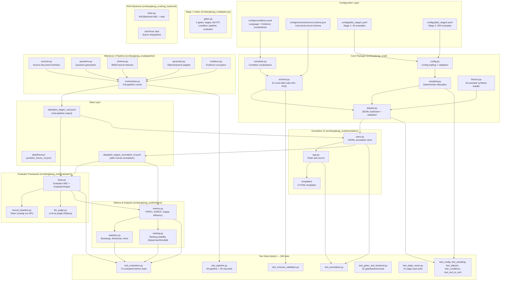
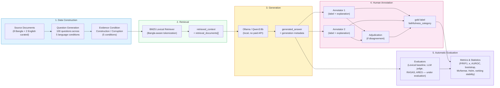
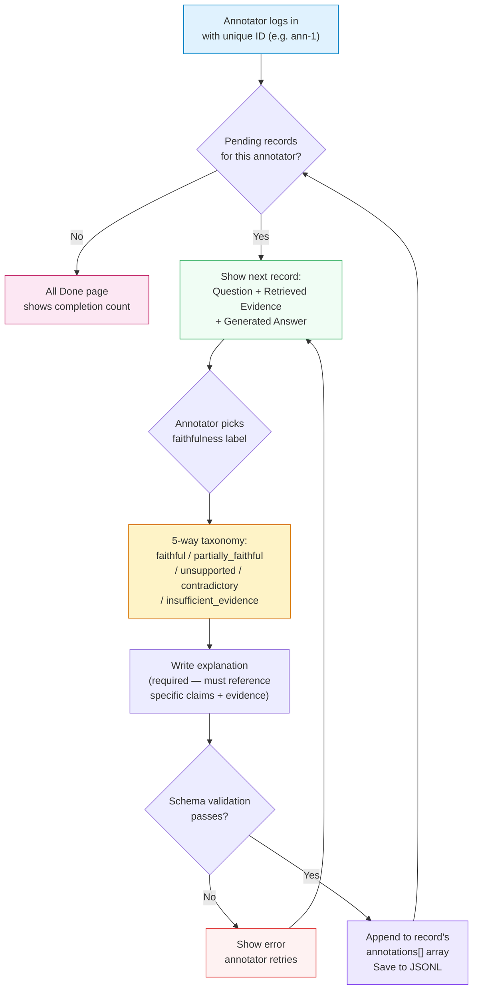
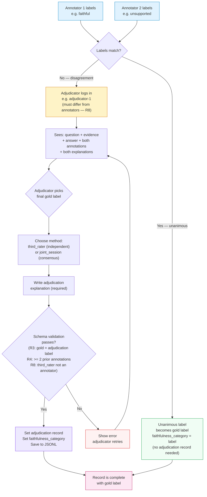

# Benchmarking RAG Faithfulness Evaluation in Low-Resource and Code-Mixed Languages: A Bangla Study

> Research repository — ICLR 2027 target

## Research Objective

We investigate whether existing RAG faithfulness evaluators that perform reasonably well in English remain reliable when transferred to:

- Native Bangla RAG
- Translated Bangla data
- Bangla-English code-mixed RAG
- Controlled retrieval conditions

The project focuses on evaluator reliability, not only model performance. Human annotations will serve as the independent reference standard.

## Research Questions

**RQ1.** How well do existing RAG faithfulness evaluators agree with human judgments on native Bangla RAG?

**RQ2.** How does evaluator reliability change under Bangla-English code-mixing, translated versus native data, and controlled retrieval corruption?

**RQ3.** Which evaluation approach provides the best trade-off between human agreement, robustness, ranking stability, cost, and latency?

---

## Architecture Overview

The repository is organized around a strict separation of concerns:
**retrieval**, **generation**, **annotation**, and **evaluation** are
logically isolated stages that enrich the same record without overwriting
each other's data.



---

## Pipeline Flow

Every benchmark record is **created once and enriched by later stages**
without ever being redesigned. The pipeline runs end-to-end:
source documents → question generation → retrieval → evidence construction
→ generation → human annotation → evaluation.



### Key pipeline principles

- **Provenance is never lost.** Every question traces to a `source_span`;
  every retrieval stores exact `retrieved_context` + `retrieval_documents[]`;
  every generation stores model, settings, prompt version, seed, timestamp.
- **Corruption is never silent.** Modified evidence carries
  `corruption_metadata` (type, original/modified IDs, operation, seed);
  originals are always preserved in `source_text`.
- **Gold labels come only from humans.** Schema rule R3 mechanically blocks
  any `faithfulness_category` lacking human provenance. Automatic evaluators
  write only to `evaluator_outputs[]`.
- **Previous stages are never overwritten.** `save_dataset()` refuses to
  overwrite by default; corrections create a new `dataset_version`.

---

## Dataset Lifecycle — Where Data Lives, How Annotation Works, Where It's Stored

This section explains the complete data flow from pipeline output to
annotated gold-standard dataset.

### Step 1: Pipeline generates the dataset

```bash
.venv/bin/python scripts/run_pipeline.py --output data/pilot_stage1_real.jsonl
```

The pipeline produces `data/pilot_stage1_real.jsonl` — 500 records
(100 questions × 5 evidence conditions) with:

- Source documents and spans
- Questions in 5 language conditions
- BM25 retrieval results
- Controlled evidence (correct / partially_relevant / irrelevant / contradictory / missing)
- Generated answers from Qwen3:8b via Ollama
- **No gold labels** — `gold_label: null`, `annotations: []`

### Step 2: Copy for annotation (protect the original)

```bash
cp data/pilot_stage1_real.jsonl data/pilot_stage1_annotated_v0.jsonl
```

The original `pilot_stage1_real.jsonl` is the pipeline output — never annotate
it directly. Always work on a copy so the pipeline output remains reproducible.

### Step 3: Human annotation via web UI

```bash
.venv/bin/python scripts/run_annotation_server.py \
    --dataset data/pilot_stage1_annotated_v0.jsonl \
    --mode annotate
```

Open `http://127.0.0.1:5000` in your browser.

**What the annotator sees:**
- Question (in Bangla, English, code-mixed, or Banglish)
- Retrieved evidence/context
- Generated answer

**What the annotator does NOT see (hidden by the store):**
- Source document text
- Intended answer
- Evidence condition (correct/irrelevant/contradictory/etc.)
- Corruption metadata
- Other annotators' labels
- Automatic evaluator outputs

**Where annotations are stored:** Annotations are saved **in place** to the
same JSONL file passed with `--dataset` (i.e.,
`data/pilot_stage1_annotated_v0.jsonl`). Each annotation is appended to the
record's `annotations[]` array. The file is rewritten after each submission
with full schema validation.

### Step 4: Second annotator (independent)

A second person logs in with a different ID (e.g., `ann-2`) and labels the
same records. They cannot see annotator 1's labels.

### Step 5: Adjudication (if annotators disagree)

```bash
.venv/bin/python scripts/run_annotation_server.py \
    --dataset data/pilot_stage1_annotated_v0.jsonl \
    --mode adjudicate
```

When annotators disagree, an adjudicator (a third person, never one of the
annotators — schema rule R8) reviews both labels and explanations, then
assigns the final gold label. The adjudication record is saved to the same
JSONL file.

### Step 6: Gold labels are set

Gold labels (`faithfulness_category`) are set only through:
- **Unanimous agreement** — both annotators pick the same label → gold is set automatically
- **Adjudication** — third rater picks the final label → gold is set from adjudication

Schema rule R3 prevents any gold label from existing without human provenance.

### Data file summary

| File | Purpose | Gold labels? |
|---|---|---|
| `data/fixtures/synthetic_fixture_v0.jsonl` | 10-record synthetic test fixture | No |
| `data/pilot_stage1_real.jsonl` | Pipeline output (500 records) | No |
| `data/pilot_stage1_annotated_v0.jsonl` | Copy for human annotation | Yes (after annotation) |

---

## RAGTruth and the English Baseline

### Supervisor's guidance

> "RAGTruth is the best place to start, not necessarily the final dataset.
> It gives us a strong English reference point; then we need to establish
> what genuinely new Bangla/native/code-mixed component we should build."
>
> "But don't download/translate it into data/ yet. First we need to verify
> the license and decide exactly which subset we can adapt for Bangla."

### What RAGTruth provides

RAGTruth (MIT licensed, by Particle Media) contains:

- **`source_info.jsonl`** — source/context text, task type (Summary/QA/Data2txt),
  source collection (CNN/DM, etc.), and the original prompt
- **`response.jsonl`** — generated responses from multiple LLMs (GPT-4, GPT-3.5,
  Mistral, Llama-2) with hallucination span annotations:
  - `Evident Conflict` — response contradicts source
  - `Subtle Conflict` — minor contradiction
  - `Evident Baseless Info` — unsupported claim
  - `Subtle Baseless Info` — subtly unsupported claim

### How we use RAGTruth (and what we don't do)

| What we do | What we don't do |
|---|---|
| Use RAGTruth as a structural reference for our schema | Download it into `data/` as-is |
| Use it for the English baseline condition only | Translate RAGTruth into Bangla |
| Learn from its hallucination annotation taxonomy | Use RAGTruth annotations as our gold labels |
| Compare our Bangla findings against English RAGTruth results | Claim RAGTruth covers Bangla (it doesn't) |

### What's genuinely new in our Bangla component

RAGTruth is English-only. Our contribution is:

1. **Native Bangla source documents** — 8 curated Bangla passages about
   Bangladesh (geography, history, culture, economy) with questions targeting
   specific evidence spans
2. **5 language conditions** — native Bangla, translated Bangla, code-mixed
   (Bangla+English in Bengali script), Banglish (romanized Bangla), English baseline
3. **Bangla-aware retrieval** — BM25 with tokenization that handles Bengali
   Unicode script
4. **Controlled evidence corruption in Bangla** — irrelevant passages and
   contradiction prefixes in Bengali
5. **Local generation** — Qwen3:8b via Ollama, no paid API required
6. **Independent human annotation** — Bangla-speaking annotators label
   faithfulness using our 5-way taxonomy

The `load_ragtruth_english()` function in
[src/banglarag_eval/pipeline/sources.py](src/banglarag_eval/pipeline/sources.py)
can load RAGTruth's `source_info.jsonl` for the English baseline condition,
but it is not called by the default pipeline. RAGTruth data is not stored
in `data/`.

---

## Two-Stage Pilot Design


### Stage 1 gates (pre-registered)

| Gate | Threshold | On failure |
|---|---|---|
| Annotation agreement | Cohen's κ ≥ 0.60 (target ≥ 0.70), 95% bootstrap CI | Revise guidelines/taxonomy |
| Taxonomy adequacy | < 10% `NO-FIT:` markers | Revise taxonomy; version bump |
| Condition integrity | ≥ 90% blind re-label match | Fix construction; regenerate cells |
| Pipeline integrity | 100% records pass validation | Fix tooling |
| Evaluator harness | ≥ 95% evaluator output success | Fix adapters; re-run |

### Current status

| Component | Status |
|---|---|
| Schema and validation (R1–R10) | Complete — 345 tests passing |
| Annotation UI | Complete — Flask web app with login, annotate, adjudicate |
| Source document interface | Complete — 8 Bangla + 2 English curated documents |
| Question generation | Complete — 100 questions across 5 language conditions |
| BM25 retrieval | Complete — Bangla-aware tokenization |
| Generation (Ollama/Qwen3) | Complete — 498/500 records generated by Qwen3:8b, 2 timeout fallbacks |
| Evidence corruption | Complete — 5 conditions with metadata |
| Real pilot dataset | **Complete — 500 records in `data/pilot_stage1_real.jsonl` (1.9 MB)** |
| Evaluator framework | **Complete — LexicalBaselineEvaluator + LLMJudgeEvaluator (Issue #11)** |
| Metrics module | **Complete — P/R/F1, AUROC, kappa, correlation, efficiency (Issue #12)** |
| Statistical analysis | **Complete — Bootstrap, McNemar, Holm correction (Issue #13)** |
| Ranking stability | **Complete — Spearman/Kendall ranking comparison (Issue #14)** |
| RAGBackend interface | **Complete — RAGBackend ABC + StubRAGBackend + SemFuseRAGBackend stub (Issue #15)** |
| Stage 1 gate measurement | **Complete — gates.py measures all 5 gates (Issue #10)** |
| Evaluator harness | **Complete — 500/500 lexical baseline outputs on pilot dataset** |
| Human annotation | Not started — needs 2 independent annotators (Issue #9) |
| Stage 1 gates (annotation) | 3/5 pass — condition integrity, pipeline integrity, evaluator harness pass; annotation agreement + taxonomy need human annotators |

### Pilot dataset statistics (generated 2026-08-30)

| Language condition | Records | Evidence condition | Records |
|---|---|---|---|
| native_bangla | 120 | correct | 100 |
| translated_bangla | 120 | partially_relevant | 100 |
| code_mixed | 120 | irrelevant | 100 |
| banglish | 120 | contradictory | 100 |
| english | 20 | missing | 100 |
| **Total** | **500** | **Total** | **500** |

- Generation model: Qwen3:8b via Ollama (local, no paid API)
- Gold labels: 0 (correct — humans must annotate)
- Annotations: 0 (correct — not yet annotated)
- Average latency: ~5-17s per record depending on evidence condition

---

## Human Annotation Flow

The annotation web UI enforces the protocol from `docs/annotation_guidelines.md`:
annotators see only the question, retrieved evidence, and generated answer —
never the source document, intended answer, evidence condition, other
annotators' labels, or evaluator outputs.



### Adjudication flow (when annotators disagree)



---

## Faithfulness Taxonomy — Decision Procedure

Annotators apply this ordered procedure (from `docs/annotation_guidelines.md`).
The procedure is authoritative; the table is a summary.


### Boundary cases (from annotation guidelines)

- **True-but-unsupported** → `unsupported` (faithfulness is to evidence, not world truth)
- **Faithful-to-wrong-evidence** → `faithful` (if evidence itself is wrong and answer repeats it)
- **Numeric materiality** → compatible if equal after rounding to answer's precision
- **Abstention** → `faithful` if justified, `unsupported` if false refusal (not `contradictory`)
- **Script difference** → "Dhaka" / "ঢাকা" / "Dhaka" are equivalent; script alone ≠ unfaithful

---

## Planned Benchmark Conditions

### Language

1. Native Bangla
2. Translated Bangla
3. Bangla-English code-mixed (Bengali script with embedded English)
4. Banglish / romanized Bangla — a distinct exploratory script condition,
   deliberately not collapsed into code-mixing
5. English baseline (control only)

### Evidence

1. Correct/relevant
2. Partially relevant
3. Irrelevant
4. Contradictory
5. Missing/no evidence

The benchmark will separate retrieval quality from downstream answer faithfulness.

---

## Candidate Automatic Evaluators

These are the systems **under evaluation**, compared against the human
reference standard — they are never gold themselves:

- RAGAS
- Independent LLM-as-a-judge evaluators
- ARES, where technically feasible
- Encoder-based hallucination detectors
- Simple non-neural baselines

The final evaluator set will be determined after the pilot. Human expert
annotation is not in this list: it is the independent reference standard
against which all of the above are measured.

## SemFuse

SemFuse may be used as an experimental RAG platform for controlled retrieval and generation experiments.

**Important:** SemFuse's internal grounding/faithfulness mechanism is NOT the benchmark gold standard.

Gold labels must be independently established through human annotation.

---

## Running Locally (No Paid APIs Required)

### Prerequisites

```bash
# Create virtual environment
python3 -m venv .venv
.venv/bin/pip install -r requirements.txt

# Install Ollama for local generation
# Download from https://ollama.com
ollama pull qwen3:8b    # ~5GB, one-time download
```

### Run the test suite

```bash
.venv/bin/python -m pytest tests/            # 313 tests
```

### Build the pilot dataset

```bash
# Full pipeline with Ollama generation (500 records, ~35 min):
.venv/bin/python scripts/run_pipeline.py

# Offline mode (no Ollama, uses intended answers as placeholders):
.venv/bin/python scripts/run_pipeline.py --no-ollama

# Specific conditions only:
.venv/bin/python scripts/run_pipeline.py \
    --languages native_bangla code_mixed \
    --evidence correct contradictory
```

Output: `data/pilot_stage1_real.jsonl` (500 records, no gold labels).

### Regenerate the synthetic fixture

```bash
.venv/bin/python scripts/build_synthetic_fixture.py
```

A 10-example synthetic fixture
([data/fixtures/synthetic_fixture_v0.jsonl](data/fixtures/synthetic_fixture_v0.jsonl))
covers every language and evidence condition and exists purely to test the
pipeline — it is not research data.

---

## Human Annotation (Local Web UI)

A built-in Flask web app lets human annotators label records from their
browser. Annotations are validated against the schema before saving, and
annotators never see provenance metadata (source text, intended answer,
evidence condition, evaluator outputs, or other annotators' labels).

### Quick start

```bash
# Install Flask (if not already installed):
.venv/bin/pip install flask>=3.0

# 1. Copy the pipeline output for annotation (protect the original):
cp data/pilot_stage1_real.jsonl data/pilot_stage1_annotated_v0.jsonl

# 2. Start the annotation server:
.venv/bin/python scripts/run_annotation_server.py \
    --dataset data/pilot_stage1_annotated_v0.jsonl \
    --mode annotate

# 3. For adjudication (resolving annotator disagreements):
.venv/bin/python scripts/run_annotation_server.py \
    --dataset data/pilot_stage1_annotated_v0.jsonl \
    --mode adjudicate
```

Then open `http://127.0.0.1:5000` in your browser.

### Annotation workflow

1. **Annotator 1** logs in with their ID (e.g. `ann-1`), sees each
   record one at a time (question, retrieved evidence, generated answer),
   picks a faithfulness label, writes an explanation, and submits.
2. **Annotator 2** logs in with a different ID (e.g. `ann-2`) and labels
   the same records independently — they cannot see annotator 1's labels.
3. When annotators **agree**, the unanimous label becomes the gold label
   automatically (schema rule R3).
4. When annotators **disagree**, an **adjudicator** logs in (e.g.
   `adjudicator-1`), switches to `--mode adjudicate`, sees the
   disagreeing labels + explanations, and assigns the final gold label.
   A `third_rater` adjudicator must be a different person from the
   annotators (schema rule R8).

Set `BANGLARAG_ANNOTATION_SECRET` in your environment for stable
sessions across server restarts.

See [docs/annotation_guidelines.md](docs/annotation_guidelines.md) for
the full annotation protocol, taxonomy, and decision procedure.

---

## Documentation

- [docs/RESEARCH_PROTOCOL.md](docs/RESEARCH_PROTOCOL.md) — full research protocol
- [docs/pilot_design.md](docs/pilot_design.md) — pilot stages, sampling, gates
- [docs/data_schema.md](docs/data_schema.md) — record schema and validation rules
- [docs/annotation_guidelines.md](docs/annotation_guidelines.md) — human annotation protocol
- [docs/evaluation_protocol.md](docs/evaluation_protocol.md) — evaluators, metrics, statistics

---

## Repository Structure

```text
BanglaRAG-Eval/
├── README.md
├── CONTRIBUTING.md
├── LICENSE
├── .env.example        # environment variable template (Ollama, OpenAI, etc.)
├── .gitignore
├── requirements.txt
├── pyproject.toml
├── configs/            # conditions, pilot configs, machine-readable schema
│   ├── conditions.yaml
│   ├── pilot_stage1.yaml
│   ├── pilot_stage2.yaml
│   └── schema/record.schema.json
├── data/               # fixtures (committed); pilot data (git-ignored)
│   ├── fixtures/synthetic_fixture_v0.jsonl   # 10-record test fixture
│   ├── pilot_stage1_real.jsonl               # pipeline output (not committed)
│   └── pilot_stage1_annotated_v0.jsonl       # annotated copy (not committed)
├── docs/               # protocol, pilot design, schema, annotation, evaluation
│   ├── RESEARCH_PROTOCOL.md
│   ├── pilot_design.md
│   ├── data_schema.md
│   ├── annotation_guidelines.md
│   └── evaluation_protocol.md
├── experiments/        # experiment definitions (Milestone 2+)
├── scripts/            # fixture builder, annotation, pipeline, evaluator runners
│   ├── build_synthetic_fixture.py
│   ├── run_annotation_server.py
│   ├── run_pipeline.py                 # Milestone 2 pipeline runner
│   ├── run_evaluators.py               # Run evaluators + compute metrics
│   ├── setup_annotation.py             # Create annotation working copy
│   └── migrate_schema.py               # Schema migration (nested -> flat)
├── src/                # banglarag_eval package
│   └── banglarag_eval/
│       ├── annotation/ # Flask web UI for human annotation + adjudication
│       │   ├── __init__.py
│       │   ├── app.py       # Flask routes (login, annotate, adjudicate)
│       │   ├── store.py     # JSONL annotation store with validation
│       │   ├── templates/   # 6 HTML templates
│       │   └── static/      # CSS with Bengali font support
│       ├── pipeline/   # Milestone 2 pipeline (real data construction)
│       │   ├── __init__.py
│       │   ├── sources.py       # Source document interface + RAGTruth loader
│       │   ├── questions.py     # Question generation + language transforms
│       │   ├── retriever.py     # BM25 lexical retriever (Bangla-aware)
│       │   ├── generator.py     # Ollama/Qwen3 generation adapter
│       │   ├── evidence.py      # Evidence construction + controlled corruption
│       │   └── orchestrator.py  # Full pipeline runner
│       ├── evaluators/  # Evaluator framework (Issue #11)
│       │   ├── __init__.py
│       │   ├── base.py            # Evaluator ABC + EvaluatorOutput
│       │   ├── lexical_baseline.py # Token overlap baseline (no API)
│       │   └── llm_judge.py       # LLM-as-judge via Ollama (cross-model)
│       ├── metrics/     # Metrics, statistics, ranking (Issues #12-#14)
│       │   ├── __init__.py
│       │   ├── metrics.py         # P/R/F1, AUROC, kappa, correlation, efficiency
│       │   ├── statistics.py      # Bootstrap, McNemar, Holm correction
│       │   └── ranking.py         # Ranking stability (Spearman/Kendall)
│       ├── rag_backend/ # RAG infrastructure interface (Issue #15)
│       │   ├── __init__.py
│       │   └── base.py            # RAGBackend ABC + Stub + SemFuse stub
│       ├── __init__.py
│       ├── config.py   # pilot config loading + validation
│       ├── constants.py# canonical condition vocabularies
│       ├── dataset.py  # JSONL load/save with validation
│       ├── fixtures.py # 10-example synthetic fixture builder
│       ├── gates.py    # Stage 1 gate measurement (Issue #10)
│       ├── sampling.py # deterministic condition-cell allocation
│       └── schema.py   # record schema + 10 cross-field validation rules
└── tests/              # 345 tests
    ├── conftest.py
    ├── test_schema_validation.py    # 46 tests — schema rules R1–R10
    ├── test_conditions.py           # 16 tests — condition vocabularies
    ├── test_config.py               # 12 tests — config loading + validation
    ├── test_sampling.py             # 6 tests  — deterministic allocation
    ├── test_dataset_loading.py      # 8 tests  — JSONL I/O
    ├── test_end_to_end_fixture.py   # 9 tests  — fixture → validate → save
    ├── test_annotation.py           # 33 tests — annotation store + Flask UI
    ├── test_edge_cases.py           # 41 tests — edge cases across all modules
    ├── test_pipeline.py             # 98 tests — pipeline + real integration
    ├── test_evaluators.py           # 73 tests — evaluators, metrics, stats, ranking
    └── test_gates_and_backend.py    # 32 tests — Stage 1 gates + RAGBackend
```

---

## GitHub Issues and Milestones

The complete roadmap is tracked in [GitHub Issues](https://github.com/shohel1arman/BanglaRAG-Eval/issues):

| Issue | Title | Milestone | Status |
|---|---|---|---|
| #2 | Milestone 1 Complete | M1 | Closed |
| #3 | Source Document Interface | M2 | Implemented |
| #4 | Question Generation Pipeline | M2 | Implemented |
| #5 | Retrieval Pipeline | M2 | Implemented |
| #6 | Generation Pipeline | M2 | Implemented |
| #7 | Evidence Construction + Corruption | M2 | Implemented |
| #8 | Build Real 30–50 Example Pilot Dataset | M2 | Implemented (500 records) |
| #9 | Run Two Independent Annotators + Adjudication | M2 | Open |
| #10 | Measure Stage 1 Gates | M2 | Implemented (3/5 pass, 2 need annotation) |
| #11 | Evaluator Framework | M2 | Implemented |
| #12 | Metrics Module | M2 | Implemented |
| #13 | Statistical Analysis Module | M2 | Implemented |
| #14 | Ranking Stability Framework | M2 | Implemented |
| #15 | SemFuse RAGBackend Interface | M2 | Implemented (stub) |
| #16 | Scale to 300–500 Examples | M3 | Open |
| #17 | Full Experiment Campaign + ICLR 2027 Paper | M3 | Open |
